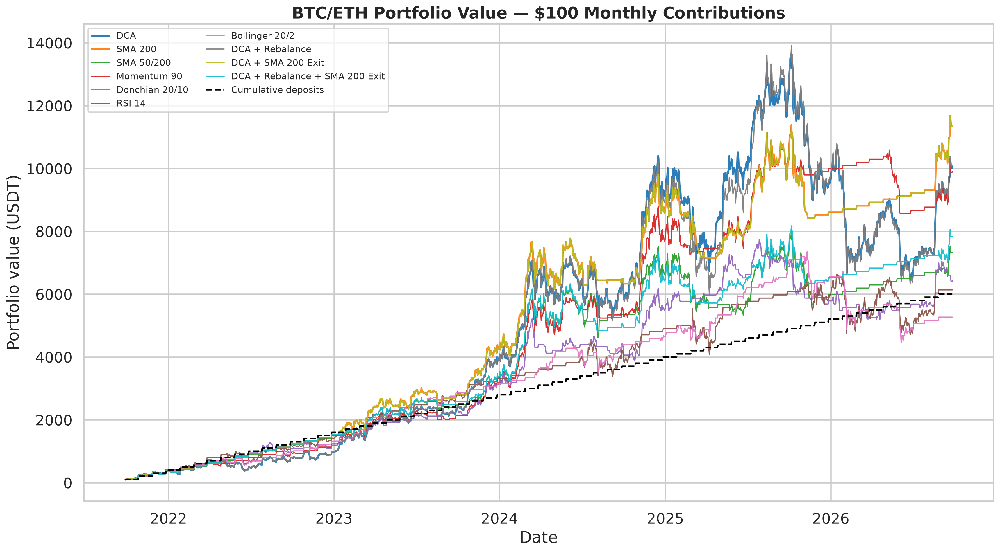

# BTC & ETH: DCA vs Active Trading

**An open, reproducible backtest of long-term crypto investing and six trading strategies.**

This repository contains the source code and data behind my research on a simple question: what happens when the same $100/month BTC–ETH portfolio follows DCA, active trading signals, or a long-term trend filter?

[Read the research article](x_article.md) · [Explore the notebook](BTC_ETH_strategy_research.ipynb) · [Full methodology and results](report.md)

## The experiment

- **Period:** September 27, 2021 – September 26, 2026 (UTC).
- **Contributions:** $100 on the 27th of each month; $60 BTC / $40 ETH; $6,000 total.
- **Market data:** Binance Spot daily BTC/USDT and ETH/USDT candles, supplied in [data/](data/).
- **Execution:** signals use completed candles; trades execute at the next day's open.
- **Costs:** 0.10% trading fee + 0.05% slippage per side.
- **Constraints:** spot only, no leverage or short positions. USDT is valued at $1 in the model.

The core comparison includes DCA, SMA 200, SMA 50/200, 90-day momentum, Donchian 20/10, RSI 14, and Bollinger Bands 20/2. Separate experiments cover portfolio rebalancing and SMA windows from 100 to 300 days.

### Selected results: main five-year period

| Strategy | Final portfolio | Max drawdown |
| --- | ---: | ---: |
| DCA | $10,041 | −76.52% |
| SMA 200 trend filter | $11,365 | −35.56% |
| Momentum 90 | $9,898 | −56.36% |
| RSI 14 | $6,134 | −46.40% |

These are **historical simulations**, not predictions or live trading results. SMA 150 reached $11,897 in a separate parameter-sensitivity experiment; selecting a parameter after seeing the backtest is not independent validation. The [rolling-window study](results/rolling_5y_summary.csv) is exploratory: some early windows begin before the available data provides a full indicator warm-up, so do not treat their headline win rates as independently verified performance.



## Repository map

| Path | Contents |
| --- | --- |
| [run_backtest.py](run_backtest.py) | Main simulation, trade ledger, performance metrics and report generation |
| [sma_window_robustness.py](sma_window_robustness.py) | SMA 100/150/200/250/300 across several start dates |
| [rolling_5y_backtest.py](rolling_5y_backtest.py) | Exploratory five-year rolling-window comparison |
| [audit_checks.py](audit_checks.py) | Trading-signal and portfolio-position audit |
| [make_charts.py](make_charts.py) | Matplotlib and Seaborn article charts |
| [data/](data/) · [results/](results/) | Stored candles, trades, daily equity, summary tables and figures |
| [tests/](tests/) | Automated checks for the simulation |

## Reproduce the study

Python 3.11+ is recommended. From the repository root:

```bash
python3 -m venv .venv
source .venv/bin/activate
pip install -r requirements.txt

python3 run_backtest.py
pytest -q
python3 audit_checks.py
python3 sma_window_robustness.py
python3 rolling_5y_backtest.py
python3 make_charts.py
```

The runner uses the saved data files when present; if they are missing, it requests daily candles from Binance. Re-running the scripts regenerates files under `results/` and may update the generated `report.md`.

## Scope and limitations

All assets are simulated at daily OHLCV prices, with simplified slippage and no modelling of order-book liquidity, partial fills, exchange outages, taxes, withdrawals or USDT depegging. Five-year windows overlap and are not independent observations. The repository is published for reproducibility and discussion, **not as investment advice**.

`three_asset_scenarios.py` tests a BTC/SOL/INJ portfolio with 50/30/20 weights from January 2021 under multiple staking and lending-rate scenarios.
